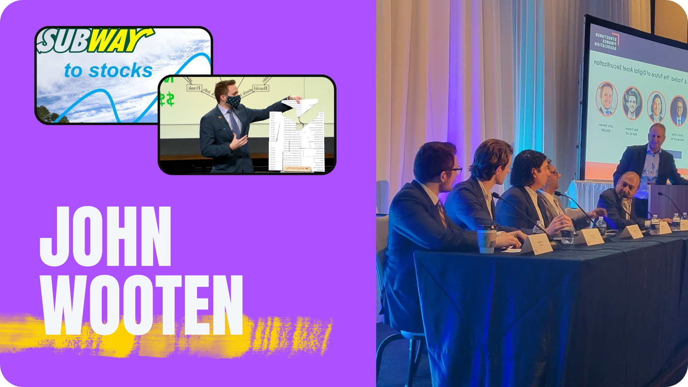
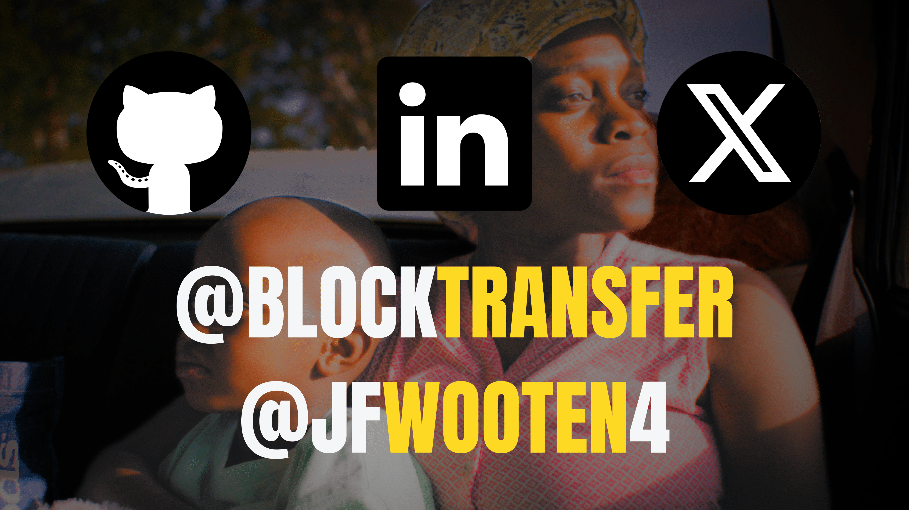

 <!-- https://www.canva.com/design/DAGGtsOcZLY/L5bg1YbLcQU1388w3Th27w/edit?ui=eyJEIjp7IlQiOnsiQSI6IlBCSGptS1BaVDZadGcxazQifX19 -->

### It's about so much more than consensus. The freedom of global populations themselves hangs in the balance. It's the [dark pools](https://youtu.be/bP74RBTE8kI?t=481s) of yesteryear which directly placed all existing capital in the hands of explicit thieves.

Passionate advocate for building an investor-centric market that frees stocks from central bankers.

[^pic]

[^pic]: Profile image credit to BGM/Prince from [music](https://youtu.be/6OoSnurHlr8). Above social image credit to Stellar Development Foundation from [media](https://docs.google.com/presentation/d/1Au5rroYIYN675IZ7FHvjw2ehpIHQSo6g7X6n1AtAKk0/edit).
