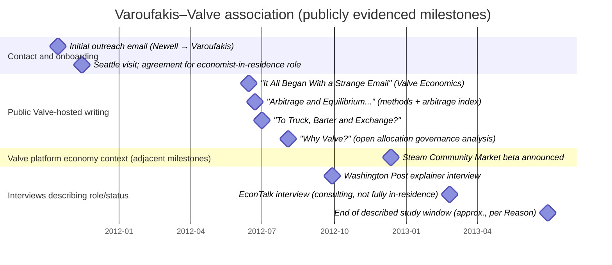

# Yanis Varoufakis’s involvement with Valve in the open allocation era

## Executive summary

The best-supported public record shows that Yanis Varoufakis’s connection to Valve began with an outreach email from entity["people","Gabe Newell","valve co-founder"] in late 2011, followed by an in-person visit to Seattle and an agreement for Varoufakis to serve as an “economist-in-residence”/consulting economist focused on Valve’s growing digital economies. citeturn3view0turn18view3turn15view0 His visible public output during the pre‑2014 “open allocation” era was concentrated in four long posts on Valve’s official economics blog (June–August 2012), plus multiple long-form interviews in 2012–2014 reflecting on the work. citeturn3view0turn15view0turn19view0

What Valve “wanted” from him is unusually clear in primary reporting: they were grappling with how to scale and connect (link) virtual economies—explicitly framed as a “shared currency” / “balance of payments” problem analogous to Eurozone monetary union challenges—and Varoufakis was a prominent analyst of the Euro crisis with relevant theoretical specialization (game theory, monetary integration problems) and a public reputation that Valve leadership already followed. citeturn3view0turn19view0turn15view0turn8search4

How Valve “built work around him” must be reconstructed indirectly, because Valve is private and does not publish internal project org charts. Still, the open allocation system is well documented in Valve’s 2012 employee handbook: no formal reporting lines, employees choose projects (effectively “100% time” self-directed), multidisciplinary “cabals” form organically, project leads act as coordinators rather than managers, and evaluation is largely peer-driven. citeturn6view0turn6view1turn26view0turn6view3turn26view1 Varoufakis’s own Valve-hosted essay describes the same operating logic: teams and time allocations (and even the famous “desks on wheels”) act as the internal “signals” that coordinate work. citeturn12view0 His interviews add that his role became partly remote/consulting once he took up teaching at entity["organization","The University of Texas at Austin","public university, austin tx"], which implies he interacted across teams as a specialist advisor rather than as a line manager—consistent with open allocation norms. citeturn18view3

Technically, Varoufakis’s clearest concrete contribution (publicly documented with methodological details) was a set of measurement tools for a complex barter-like item economy—especially the entity["video_game","Team Fortress 2","2007 multiplayer shooter"] item-trading ecosystem—built around: (a) estimating a single “one price per item” vector even in persistent disequilibrium (using trade-frequency weighting across observed exchange ratios), (b) defining “notional keys” as a synthetic numeraire, and (c) computing an “Index of Arbitrage Potential” by measuring deviations from equilibrium constraints via least-squares residuals over time. citeturn14view3turn14view2 A parallel contribution—more conceptual than computational—was his political-economy analysis of Valve’s open allocation governance as an internal “spontaneous order” coordinated by time/team allocation rather than managerial command. citeturn12view0turn12view3

Direct evidence that Valve shipped a particular feature *because* of Varoufakis’s models is not publicly available. But Valve’s contemporaneous public product trajectory strongly matches the problem space he was analyzing: Steam Trading (2011) expanded cross-game barter-like exchange, and in December 2012 Valve launched the Steam Community Market beta explicitly to “expand the Steam Economy beyond trading” and improve item exchange via price discovery and Steam Wallet funds. citeturn16search1turn16search0turn16search3 It is therefore reasonable—but should be labeled as inference—to say his work exemplifies (and likely supported) Valve’s broader shift toward instrumented, experiment-driven design of virtual markets. citeturn3view0turn14view3turn27view0turn22view1

## Scope and method

This report focuses on the “pre‑2014 open allocation era,” interpreted as (i) Varoufakis’s active Valve engagement from first contact (late 2011) through the period most sources describe as ending around mid‑2013, and (ii) Valve’s pre‑2014 management model as publicly documented in the 2012 employee handbook and contemporaneous interviews. citeturn15view0turn18view3turn6view0turn6view1

Priority was given to primary/official materials and original interviews:

- Valve-hosted “Valve Economics” posts authored by Varoufakis (archived snapshots of the official Valve blog). citeturn3view0turn14view3turn13view0turn12view0  
- Valve’s 2012 employee handbook (primary internal document, publicly circulated). citeturn6view0turn26view0turn26view1  
- Valve/Steam announcements about market infrastructure (Steam Trading, Steam Community Market). citeturn16search1turn16search0turn16search3  
- Long-form media interviews with Varoufakis and/or transcripts (entity["organization","The Washington Post","newspaper, washington dc"]; entity["organization","Reason","magazine, us"]; entity["podcast","EconTalk","economics podcast"]). citeturn19view0turn15view0turn9view0

Where the public record is incomplete (especially around internal adoption and org structure), I explicitly mark uncertainties and separate inference from direct evidence.

## Timeline of association and roles

### Narrative timeline with roles and visits

**Late 2011 (first contact and Seattle visit).** Varoufakis’s first Valve-hosted post states the initial outreach email arrived “late at night in October of last year,” and the message asked for consulting help as Valve scaled and linked virtual economies; he then added a “two-day visit to Seattle” to meet Valve staff, after which an agreement was reached that he would become “in some capacity … Valve’s economist-in-residence.” citeturn3view0 In the entity["podcast","EconTalk","economics podcast"] transcript, he dates this more specifically to November 2011 (“about to visit the United States… on a book tour”) and describes an email from Gabe, followed by ongoing work. citeturn18view3

**Early 2012 to mid‑2013 (economist-in-residence / study period).** entity["organization","Reason","magazine, us"] reports Varoufakis “agreed to become the company’s first official in-house economist” and that “from early 2012 through the middle of 2013” he studied Valve’s game economies, posting occasionally on the company blog. citeturn15view0 This is consistent with the general arc implied by his own posts and the 2012–2013 interview trail (though the exact contractual terms are not public). citeturn3view0turn19view0turn18view3

**June–August 2012 (public “Valve Economics” output).** The archived official Valve Economics blog index (Sept 2012 capture) shows four posts:
- “It All Began With a Strange Email” (June 14, 2012) citeturn3view0  
- “Arbitrage and Equilibrium in the Team Fortress 2 Economy” (June 22, 2012) citeturn4view0turn14view3  
- “To Truck, Barter and Exchange?” (July 1, 2012) citeturn13view0  
- “Why Valve?” (August 3, 2012) citeturn12view0  

Notably, the June 14 post promises weekly reports, but the public record on the Valve-hosted blog ends after these four long posts—suggesting either a change in plan, a shift to non-public work, or later posts not preserved in the snapshots used here. citeturn3view0

**September 2012 (major explanatory media coverage).** In an interview-driven explainer, the entity["organization","The Washington Post","newspaper, washington dc"] describes his hire as “recent,” explicitly links it to Valve’s desire to connect game economies via a shared currency, and includes direct description of his work constraints (players quickly detect randomized pricing experiments). citeturn19view0

**February 2013 (status shifts to ongoing consulting while based in Austin).** In the EconTalk transcript, Varoufakis explains that while he initially agreed to be “stationed” at Valve, he and Valve came to an understanding that he needed to be at the university, so he was “no longer in residence” but continued consulting with Gabe Newell and having “a great deal of fun doing that.” citeturn18view3

### Mermaid timeline chart (key dated events)



**Notes on date uncertainty:** “2011‑10‑15” and “2011‑11‑15” are representative anchors used to plot “October 2011” and “November 2011” (the sources specify months rather than exact days). citeturn3view0turn18view3turn15view0 The “2013‑06‑30” endpoint reflects entity["organization","Reason","magazine, us"]’s “middle of 2013” phrasing, not a dated separation or contract end. citeturn15view0

## Why Valve found him attractive

### The immediate business problem: scaling and linking economies

In Varoufakis’s own Valve-hosted narrative, the outreach email from Gabe frames Valve’s problem in macroeconomic terms: they were “running into a bunch of problems” while scaling virtual economies and “link[ing] economies together,” including “balance of payments” issues when creating a “shared currency.” citeturn3view0turn19view0 That is a precise match to Varoufakis’s public intellectual profile at the time: he had become visible during the Euro crisis and wrote extensively about the consequences of monetary integration with asymmetric economies (Germany/Greece being the explicit analogy used in the email). citeturn3view0turn19view0turn15view0

This is not generic “economist helps pricing” rationale; it is a specialized *monetary-union / interlinked-economy* rationale. The Washington Post summarizes Valve’s intention in similarly explicit terms: they wanted to link games so players could trade across them, and Gabe’s email to Varoufakis made the “shared currency” and “balance of payments” framing explicit. citeturn19view0

### A fit with Valve’s experimentation culture

A second, deeper reason was methodological: Valve’s digital platforms provide full transactional logs and rapid iteration pathways. Varoufakis repeatedly characterizes this as an economist’s “dream” because it eliminates sampling and enables rule changes followed by observation of behavioral response. citeturn3view0turn15view0turn19view0

This orientation aligned with Valve’s own public stance on experimentation. In a 2011 transcript-style interview, entity["organization","GeekWire","tech news site, seattle"] reports Gabe describing “behind-the-scenes pricing experiments” on Steam, including silent price variation and large “sale” experiments, and emphasizes that Valve would “keep running these experiments” because observed outcomes contradicted simple models. citeturn27view0 In a 2012 GDC deck by Valve’s Joe Ludwig, Valve similarly foregrounds economy design lessons like avoiding unnecessary currencies and protecting the value of existing items—indicating the company already treated virtual economies as a designed-and-measured subsystem. citeturn22view1turn22view3

Varoufakis therefore offered not just domain expertise but an intellectual posture consistent with Valve’s “instrument everything, test, iterate” approach.

### Reputation and communicative capacity

Varoufakis was not recruited as an obscure back-office analyst. Multiple sources emphasize his public prominence during the crisis, and media coverage of the hire itself suggests Valve expected both internal analytical value and external legitimacy (or at least anticipated public interest). citeturn15view0turn19view0turn8search4 His long-form writing on Valve’s own platform also indicates Valve was comfortable letting him publicly explain the stakes and methods—unusual if the role were purely operational. citeturn3view0turn14view3

## How Valve structured work around him under open allocation

### What “open allocation” meant at Valve in 2012

Valve’s 2012 employee handbook describes a “flat” company: no management and no one “reports to” anyone else; employees have the power to green-light and ship projects. citeturn6view0 Rather than being assigned tasks, employees choose projects (“the percentage is 100”), and “vote on projects with their feet (or desk wheels).” citeturn6view1 Decision-making is described as emergent: Valve decides what to work on “by waiting for someone to decide that it’s the right thing to do, and then letting them recruit other people to work on it with them.” citeturn6view2

Teams form as multidisciplinary “cabals” built to ship a product or major feature; they form organically and people join because they believe the work is important. citeturn26view0 “Team leads” exist but are explicitly not traditional managers; they are “clearinghouse[s] of information” who “serve the team.” citeturn6view3 Performance and pay are heavily peer-mediated via peer reviews and “stack ranking,” reinforcing internal accountability without classic hierarchy. citeturn26view1

Varoufakis’s Valve-hosted essay independently echoes this picture and adds his own interpretive frame: the symbolic importance of desk wheels and the claim that Valve runs an internal “spontaneous order” coordinated by decentralized time/team allocations rather than command. citeturn12view0turn12view2

### What this implies about Varoufakis’s position inside Valve

Because Varoufakis’s assignment centered on economy analysis and experimentation, the open allocation structure likely shaped “how work formed around him” in three ways.

**He functioned as a high-status specialist resource, not a manager.** Open allocation makes it structurally difficult for a visiting economist to “own” a product area in a managerial sense; instead, such a person becomes valuable by enabling others’ projects with analysis, measurement, and conceptual framing. The handbook’s description of team leads as non-managerial coordinators suggests similar “service” roles are culturally legible, which maps onto an economist-in-residence role. citeturn6view3turn26view0

This is reinforced by Varoufakis’s own description (EconTalk) that he was “no longer in residence” once he was teaching in Austin but continued consulting with Gabe—consistent with a consultative role spanning multiple initiatives rather than a single embedded production team. citeturn18view3

**Work likely clustered around data access + implementation capacity.** In his “Arbitrage and Equilibrium” post, Varoufakis repeatedly uses “we” when describing the creation of price estimation and arbitrage metrics and mentions “computational issues” they had to resolve—strongly implying collaboration with Valve personnel who could extract trade logs, build pipelines, and run computations at Steam scale. citeturn14view3 Under open allocation, the practical way to operationalize such work would be for an economy-focused cabal (or multiple cabals) to recruit him when his analysis unblocked design or policy decisions.

**Persuasion and transparency substituted for formal authority.** Open allocation shifts influence from formal authority to reputation and demonstrated usefulness. Varoufakis’s decision to publish long methodological pieces on Valve’s own blog can be interpreted as a dual-purpose artifact: (i) external thought leadership, and (ii) internal “proof of work” that makes it easier for teams to understand, trust, and reuse the frameworks. citeturn3view0turn14view3turn12view0 This interpretation is consistent with how the handbook says projects staff up: strong projects with demonstrated value attract people; and information about teams/projects is shared via observation and intranet. citeturn6view1turn12view0

### Decision-making and experiment constraints in practice

A subtle but important constraint appears in the Washington Post interview: when Varoufakis tried to run randomized control trials on pricing strategies, players would “rapidly catch on and spread the word,” limiting experimental control. citeturn19view0 That statement matters for “how Valve built work around him,” because it implies his output could not be “pure academic experimentation”; it had to be compatible with live community scrutiny—a constraint also discussed in the Reason interview (trade-off between control and not harming player enjoyment). citeturn15view0

This constraint likely increased the value of *observational* metrics (price estimation, arbitrage indices, disequilibrium measures) relative to intrusive experiments—exactly the type of tooling he documented in detail. citeturn14view3turn14view2

## What he developed or contributed to, and how it was used

### A measurement framework for a large disequilibrium barter economy

Varoufakis frames Steam trading (at least for TF2 items) as a “peculiarly sophisticated barter economy,” meaning a system with many bilateral exchanges and no stable monetary numeraire—contrary to standard “barter → money” evolutionary stories. citeturn4view0turn13view0

His key technical problem, stated explicitly: if the economy is “hardly ever in equilibrium,” then in principle there is no single stable “price” per item; yet to analyze the economy (size, valuation, time trends) you need a workable single-price representation. citeturn14view3 His documented solution has three tightly connected components.

**Single-price estimation via trade-frequency weighting.** He describes starting from equilibrium conditions (relationships among relative prices that would hold if markets cleared with no arbitrage), then using observed bilateral trade frequencies to weight which exchange relationships should dominate the implied price vector. Put differently: rather than taking any one exchange rate as “the” price, he builds a composite estimate influenced more by the most frequent and influential trades. citeturn14view3

**“Notional keys” as a synthetic numeraire.** Because keys (or key-like items) appear as a natural anchor in many exchanges, he defines prices in terms of “notional keys”—a “made-up currency” that converges to actual key-based prices as the economy approaches equilibrium. This is effectively a normalization device to compare heterogeneous items on a common scale under persistent disequilibrium. citeturn14view3

**An “Index of Arbitrage Potential” via least-squares disequilibrium.** Once a single price vector is constructed, he measures how far the economy is from equilibrium by computing deviations from the equilibrium equalities and aggregating them (he describes using least squares of the differences between left- and right-hand sides). This aggregate becomes a time series index; spikes correspond to periods with more arbitrage opportunity, which he associates empirically with item releases and major sales when community price discovery is still forming. citeturn14view2turn14view3

This is not merely academic exposition: he frames this as “one of the first things I did at Valve” and explicitly presents it as a tool to “observe how far or how close to equilibrium our economies are.” citeturn14view3

### A conceptual model of “impure exchanges” and why currency may not emerge

In his July 1, 2012 post, Varoufakis argues many Steam exchanges are not “pure” market trades at equivalent subjective value; instead they can include gift-like unloading of surplus items, acceptance of “remarkably low ‘value’,” and other social motives, which complicates the standard story that barter economies inevitably “monetize.” citeturn13view0 He links this to the observed instability of currency-like items in TF2 and the persistence of barter even as trade volume grows. citeturn4view0turn13view1

Operationally, this kind of analysis matters because a platform designer deciding between (i) pure barter, (ii) an internally managed currency, or (iii) a market mechanism with a standardized unit of account needs to know whether players are acting like classic traders or like community members using exchange for broader social functions.

### A governance analysis of Valve’s open allocation as “spontaneous order”

Varoufakis’s August 2012 Valve-hosted essay is effectively a political-economy analysis of Valve itself. He describes the “wheel” on desks as a practical mechanism enabling employees to reallocate teams and time without permission, and he claims Valve differs from “10%/20% time” companies by insisting employees allocate “100%” of their time to projects of their choosing. citeturn12view0

He interprets this as an internal “spontaneous order” coordinated by visible patterns of team/time allocation rather than price signals or managerial fiat. citeturn12view0turn12view2 Even if one disagrees with his normative conclusions, the essay functions as a detailed contemporaneous description of how he believed coordination worked day-to-day—information the public otherwise rarely gets from Valve employees.

### How Valve used these outputs

**Directly evidenced uses (high confidence).**

1) **Internal economy tuning and experimentation as a service to players.** Varoufakis states that Valve’s digital economies allow changing “values, rules and settings” and observing community response; he frames his intended work as “data mining, experimentation, and calibration of services provided to customers” based on empirical findings. citeturn3view0turn8search4turn19view0 These statements directly evidence that Valve intended his work to inform operational adjustments (even if specific knobs and outcomes are not publicly enumerated).

2) **Public communication/legitimation.** Valve hosted his long-form methods writeups and governance essay on its official blog, indicating the company accepted (and likely valued) external transparency and thought leadership about the economics of their platform. citeturn3view0turn14view3turn12view0

**Plausible uses (inference, not directly documented).**

1) **Market mechanism design and price discovery improvements.** Varoufakis’s work diagnoses pervasive disequilibrium and arbitrage in a large barter economy and emphasizes the difficulty of assigning consistent prices when bilateral exchange rates conflict. citeturn14view3turn14view2 In December 2012, Valve announced (and TF2 echoed) the Steam Community Market beta as explicitly designed to “expand the Steam Economy beyond trading” and improve trading efficiency—helping buyers and sellers locate prices and convert gameplay into Steam Wallet funds. citeturn16search0turn16search3

It is therefore a reasonable inference that internal metrics like “how far from equilibrium is the economy?” and “where is arbitrage concentrated?” would be valuable inputs when designing/validating a market feature. However, no public source in the pre‑2014 record explicitly credits Varoufakis’s index as a design input to the Community Market. (So this remains *plausible and consistent*, but not proven.)

2) **Cross-economy linking strategy.** The original outreach framed linking multiple economies and managing “balance of payments” in a shared currency. citeturn3view0turn19view0 Valve’s contemporaneous direction—Steam Trading across participating games and later a wallet-based market—can be viewed as an incremental strategy for cross-game economic interoperability. citeturn16search1turn16search0 Again, alignment is strong; direct attribution is not public.

## Lasting influence, source reliability, and known gaps

### What likely persisted beyond his tenure

Two durable influences are most defensible from the evidence.

First, Varoufakis helped produce (and Valve chose to host) an unusually explicit early public articulation of Valve’s economy-as-a-platform worldview and its managerless/open allocation self-image. Those posts became widely referenced in later discussions about both virtual economies and “flat” corporate governance precisely because they were both insider-adjacent and conceptually ambitious. citeturn3view0turn12view0turn19view0

Second, his documented methods exemplify a measurement-first approach to virtual economy governance: don’t assume equilibrium; construct empirical indices of disequilibrium and arbitrage; treat virtual economies as instrumentable systems. That methodological posture is consistent with Valve’s broader experimentation culture described by GeekWire (2011) and GDC materials (2012), suggesting Varoufakis’s work was complementary to (and may have strengthened) an existing organizational habit rather than inventing it from scratch. citeturn27view0turn22view1turn14view3turn3view0

### Source comparison table

| Source | What it contributes to this question | Independence / potential bias | Reliability assessment |
|---|---|---|---|
| Valve Economics blog (archived) — “It All Began With a Strange Email” (June 14, 2012) citeturn3view0 | First-person origin story; the “linking economies/shared currency” framing; Seattle visit; stated intent (data mining, experiments, calibration); plan for weekly reports | First-person narrative; rhetorical; selective; but hosted on Valve domain at the time | **High** for “what Varoufakis said/claimed at the time”; medium for internal details that cannot be corroborated |
| Valve Economics blog (archived) — “Arbitrage and Equilibrium…” (June 22, 2012) citeturn14view3turn14view2 | Detailed technical methods: price estimation under disequilibrium, notional keys, least-squares arbitrage index; examples and interpretation | First-person, but includes methodological transparency and explicit formulas; still lacks code/data | **High** for method description; **Medium** for empirical magnitudes (graphs not always preserved in archives) |
| Valve Economics blog (archived) — “To Truck, Barter and Exchange?” (July 1, 2012) citeturn13view0turn13view1 | Conceptual classification of exchange types; why “currency” may not stabilize; implications for digital economies | First-person; partly theoretical; mixes anthropology/political economy | **Medium–High** (useful as interpretation and observation, not as audited measurement) |
| Valve Economics blog (archived) — “Why Valve?” (Aug 3, 2012) citeturn12view0turn12view3 | Best contemporaneous insider-adjacent account of how he interprets open allocation (desk wheels, 100% time allocation, team formation signals) | Normative and ideological framing; may over-idealize; still rooted in observed practice | **Medium–High** for descriptive passages; **Medium** for normative extrapolation |
| Valve Employee Handbook (2012) citeturn6view0turn6view1turn26view0turn6view3turn26view1 | Primary description of open allocation: flatness, project choice, cabals, team leads, peer review/stack ranking | Authored by Valve; aspirational; may differ from actual lived practice | **High** as “official doctrine”; **Medium** as exact reflection of day-to-day reality |
| Steam/Valve announcement: Steam Community Market beta (Dec 12, 2012) citeturn16search0turn16search3 | Official intended purpose of Market: expand economy beyond trading, price discovery and wallet funds | PR framing; does not credit internal contributors | **High** for “what Valve launched and said it was for” |
| Steam/TF2 announcement: Steam Trading Beta (Aug 2011) citeturn16search1 | Baseline platform capability: secure cross-game item trading feature existed before Varoufakis’s public posts | Product announcement; does not speak to Varoufakis | **High** for feature existence and function |
| Washington Post explainer interview (Sep 28, 2012) citeturn19view0 | Third-party interview: why hired; “shared currency/balance of payments” quote; constraint that players detect experiments | Journalist mediation; but contains direct quotes and contextualization | **High** for basic facts and quoted remarks; **Medium** for interpretive framing |
| Reason interview (May 2014) citeturn15view0 | Clear timeline window (early 2012–mid 2013); background (game theory, linking economies); reflections on learning | Retrospective; magazine narrative style | **Medium–High** for broad timeline; **Medium** for fine-grained internal details |
| EconTalk transcript (Feb 25, 2013) with entity["people","Russ Roberts","economics journalist"] citeturn18view3turn9view0 | Direct description of how he got involved, and that he was no longer fully “in residence” but continued consulting; additional operational detail about “100% time” culture | Transcript of an interview; relies on his perspective; minor transcript uncertainties flagged by site | **High** for what he said; **Medium** for generalized claims about Valve operations |

### Uncertainties, gaps, and explicit assumptions

**Key uncertainties (not resolved by public primary sources):**
- **Exact contractual status and dates.** Some reporting calls him “in-house economist,” others stress “consultant.” citeturn15view0turn19view0turn8search4turn18view3 The most defensible synthesis is: he was recruited for an economist-in-residence role, did at least one Seattle visit, and later functioned as an ongoing consultant while based at UT Austin. citeturn3view0turn18view3  
- **Internal team membership and reporting lines.** Valve’s open allocation system intentionally deemphasizes reporting lines, and no internal project documentation is public for this engagement. citeturn6view0turn26view0  
- **Direct product impact attribution.** The record does not publicly attribute the Steam Community Market (or other features) to Varoufakis’s models. The report therefore distinguishes alignment/inference from proven causality. citeturn14view3turn16search0turn16search3  
- **Completeness of Valve Economics archive.** The September 2012 archive shows four posts; it is unclear whether additional posts existed and were not captured, or whether the series ended. citeturn3view0  

**Assumptions used (and why):**
- **Open allocation mechanics are primarily described by the 2012 handbook and contemporaneous accounts** (handbook + Varoufakis essay + interviews). This is assumed to be the best available representation of the pre‑2014 era, recognizing it may blend aspiration and practice. citeturn6view0turn6view1turn26view0turn12view0turn18view3  
- **When sources specify only month/season, timeline anchors are approximate** (as shown in the mermaid chart). citeturn3view0turn18view3turn15view0  

### Primary documents (direct links)

```text
Valve-hosted (archived) “Valve Economics” index page (Sept 2012 capture):
https://web.archive.org/web/20120922140834/http://blogs.valvesoftware.com/economics/

“It All Began With a Strange Email” (June 14, 2012):
https://web.archive.org/web/20120922140834/http://blogs.valvesoftware.com/economics/it-all-began-with-a-strange-email/

“Arbitrage and Equilibrium in the Team Fortress 2 Economy” (June 22, 2012):
https://web.archive.org/web/20121020031732/http://blogs.valvesoftware.com/economics/arbitrage-and-equilibrium-in-the-team-fortress-2-economy/

“To Truck, Barter and Exchange?” (July 1, 2012):
https://web.archive.org/web/20120926151252/http://blogs.valvesoftware.com/economics/to-truck-barter-and-exchange-on-the-nature-of-valves-social-economies/

“Why Valve?” (Aug 3, 2012):
https://web.archive.org/web/20120913230340/http://blogs.valvesoftware.com/economics/why-valve-or-what-do-we-need-corporations-for-and-how-does-valves-management-structure-fit-into-todays-corporate-world/

Valve Handbook for New Employees (2012) PDF:
https://assets.sbnation.com/assets/1074301/Valve_Handbook_LowRes.pdf

Steam/Valve press release: “Steam Community Market Now In Beta” (Dec 12, 2012):
https://store.steampowered.com/oldnews/9594

Team Fortress 2 blog: “Steam Community Market beta” announcement (Dec 12, 2012):
https://www.teamfortress.com/post.php?id=9567

Team Fortress 2 blog: “Introducing Steam Trading Beta” (Aug 2011):
https://www.teamfortress.com/post.php?id=6040

Valve GDC 2012 slide deck (Joe Ludwig): “TF2: From The Orange Box to Free to Play…”:
https://cdn.fastly.steamstatic.com/apps/valve/2012/TF2_Orange_Box_To_Free_To_Play_GDC2012.pdf

EconTalk episode page and transcript:
https://www.econtalk.org/varoufakis-on-valve-spontaneous-order-and-the-european-crisis/
```