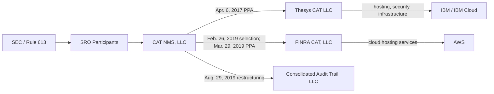
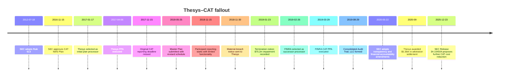

# Thesys–CAT Fallout

## Executive summary

The Thesys–CAT fallout was not a single failure point. It was a compound breakdown in procurement, contracting, schedule control, governance, and technical delivery inside one of the largest U.S. market-regulation technology programs ever attempted. The SEC adopted Rule 613 in 2012 and approved the CAT NMS Plan in November 2016; the CAT Selection Committee chose Thesys Technologies as initial plan processor in January 2017, and CAT NMS, LLC later contracted with its affiliate, Thesys CAT LLC, to build and operate the system. Publicly disclosed contract terms show a seven-year initial term, milestone-based development fees of $37.5 million through November 15, 2017, and then quarterly recurring fees of $9.375 million if milestones were achieved. Thesys publicly said it had created a dedicated Thesys CAT entity and that IBM would provide hosting on IBM Cloud along with security, infrastructure, program-management, consulting, and help-desk services. citeturn2view3turn11view0turn26search1

The relationship unraveled because Thesys missed the original November 15, 2017 go-live date, then failed to deliver a Phase I system with required functionality by November 15, 2018. SEC and CAT filings describe repeated delays, missed self-imposed milestones, incomplete functionality, and governance/project-management weaknesses at the SRO level. The SEC’s August 2018 status statement said the SROs and Thesys had missed revised deadlines; Chairman Jay Clayton’s December 2018 testimony said implementation remained “slow and cumbersome” due largely to project governance and project-management issues and that Thesys had informed the SROs it would not deliver first-phase full functionality as promised. The SEC’s 2019 CAT transparency proposal then stated that the CAT began accepting Participant data on November 15, 2018 but still lacked required functions such as event linkages and regulator query functionality. citeturn9view2turn34view0turn15view1

By late January 2019, CAT NMS concluded that Thesys could not cure its breaches in a timely way. The organization gave breach notice on November 30, 2018, cited missed deadlines and missing required functionality, terminated the Thesys agreement effective January 30, 2019, and wrote the Thesys-developed software asset down to zero, recognizing a full impairment of $75,205,874. Even after termination, Thesys was paid $10,075,000 for transition services from January 30 to April 15, 2019. CAT NMS then selected FINRA as successor processor on February 26, 2019; FINRA ultimately performed through special-purpose subsidiary FINRA CAT, LLC. Public materials indicate FINRA later used AWS for major CAT cloud-hosting services, marking a meaningful technology and vendor reset from the IBM-centered Thesys arrangement. citeturn12view0turn9view0turn9view1turn7search6

The merits fight moved into arbitration rather than public court litigation. CAT NMS’s financial statements say it filed an arbitration claim in 2019 to recover damages from Thesys for failing to meet specifications and deadlines, while Thesys filed a counterclaim for wrongful termination. In September 2020, Thesys CAT was awarded $5,360,366, which CAT NMS accrued as a settlement award payable. Later CAT fee filings disclosed that CAT Participants treated $14,749,362 of Thesys-breakup costs as excluded costs, covering American Arbitration Association costs, Pillsbury legal fees, and settlement-related costs, and they also excluded another $48,874,937 from the November 15, 2017–November 15, 2018 period plus $19,628,791 of later Thesys/transition costs. Those three exclusions total $83,253,090, all borne by Participants rather than billed to industry members. citeturn12view0turn13view0turn18view3turn18view2

The fallout changed CAT governance permanently. CAT NMS, LLC was eventually left largely to defend and resolve the Thesys dispute, while a new entity, Consolidated Audit Trail, LLC, was formed on August 29, 2019 to operate the system going forward. In 2020 the SEC adopted CAT amendments imposing more transparency and financial-accountability requirements, including a public implementation plan and quarterly progress reports. Years later, cost pressure remained central: Release No. 34-104504, published at 90 FR 61506, said the CAT’s November 2025 budget was about $188 million and that proposed cost-savings measures were expected to cut annual costs by roughly $55 million to $73 million. The Thesys episode was not the sole cause of all later CAT cost and governance issues, but it was the system’s first major operational and contracting failure, and it directly drove the switch to FINRA, the restructuring of CAT entities, the arbitration, and later cost-allocation fights over who should pay for the failed Thesys era. citeturn13view0turn15view0turn15view2turn16view1

## What happened and why it escalated

The formal architecture was straightforward. Rule 613 required the SROs to create a consolidated audit trail; the SROs formed CAT NMS, LLC to implement it; that entity contracted with Thesys CAT LLC as initial plan processor; after the breakup, CAT NMS selected FINRA CAT, LLC as successor processor; and, in August 2019, a new operating entity, Consolidated Audit Trail, LLC, replaced CAT NMS, LLC as the plan-level company while CAT NMS, LLC remained focused on the Thesys dispute. That structure is visible across the SEC Rule 613 page, the Thesys press release, the successor processor notice, and CAT NMS’s audited financial statements. citeturn2view2turn2view3turn9view0turn13view0

Procurement itself later became part of the controversy. CAT LLC’s 2024 response to comments defended the original selection process as a long, SEC-approved RFP that began in 2013, attracted 31 expressions of interest and 10 submitted bids, used a formal Selection Plan approved by the SEC in 2014, shortlisted six bidders, and ultimately selected Thesys through two rounds of voting. In other words, CAT LLC’s official ex post defense is that the selection process was procedurally sound even if the outcome later failed. That official defense conflicts with later industry criticism, which treated the award to Thesys as a costly misjudgment. citeturn22view0

Contemporaneous trade press suggests a second procurement issue: the eventual successor, FINRA, was already a serious contender in 2017. The Wall Street Journal reported at the time of Thesys’s original award that negotiations with FINRA had broken down over responsibility for cost overruns; the Journal later reported that exchanges lost confidence in Thesys by early 2019 and intended to replace it with FINRA. That does not prove the 2017 choice was unreasonable on the information then available, but it does show the dispute sits partly inside a failed procurement decision, not just a failed implementation. citeturn20search7turn20search0turn9view3

The causes of escalation also ran beyond pure coding failure. SIFMA’s April 2017 letter, sent just after Thesys’s selection, shows that the industry was already worried about five topics that later became central to the fallout: data security and privacy, prompt retirement of duplicative systems such as OATS, the implementation timeline, limits on CAT data use, and governance and funding. SIFMA said firms needed more definite timing for retirement of legacy reporting systems because otherwise they could be forced to fund both old and new regimes simultaneously. That concern mattered because CAT planners had expanded scope to OTC equities partly to accelerate OATS retirement, meaning delay created direct cost and coordination pressure. citeturn25view0turn31view0

The SEC’s own descriptions add the missing operational layer. In August 2018, SEC staff said the SROs had not yet begun reporting required CAT data, that delays continued, and that both the SROs and Thesys had missed new self-imposed deadlines. By December 2018, Chairman Clayton stated that the SROs remained out of compliance, that the CAT had only limited functionality, and that development remained slow and cumbersome largely because of SRO governance and project-management issues, while Thesys had indicated it would not deliver full first-phase functionality on the revised timeline. The official record therefore points to a dual failure: Thesys did not deliver on time, and the SRO governance framework did not control the program tightly enough. citeturn9view2turn34view0

## Timeline

The chronology below consolidates the highest-confidence public milestones from the SEC, CAT entities, audited financial statements, and contemporaneous industry materials. citeturn2view2turn11view0turn12view0turn9view0

| Date | Event | Why it mattered | Sources |
|---|---|---|---|
| July 18, 2012 | SEC adopts Rule 613 requiring a consolidated audit trail. | Established the CAT mandate and set the joint-SRO framework. | citeturn2view2 |
| February 21, 2014 | SEC approves the Selection Plan governing how the plan processor would be chosen. | Put an SEC-approved procurement process around the later Thesys award. | citeturn2view2turn22view0 |
| November 15, 2016 | SEC approves the CAT NMS Plan. | Allowed the Participants to move from planning into vendor selection and contracting. | citeturn2view2 |
| January 17–18, 2017 | CAT Selection Committee selects Thesys Technologies as plan processor and notifies the SEC. | Thesys becomes the initial processor; the notice anticipates a full PPA with milestones, SLAs, pricing, IP, liability, insurance, and termination terms. | citeturn2view2turn26search1 |
| April 6, 2017 | CAT NMS, LLC and Thesys CAT enter the Plan Processor Agreement. | Starts the formal contractual relationship; seven-year initial term and milestone-based fees later disclosed publicly. | citeturn11view0turn11view1 |
| May 9, 2017 | Thesys announces the contract publicly; says IBM will provide IBM Cloud hosting, security, infrastructure, program management, consulting, and help desk. | Confirms the dedicated Thesys CAT entity and the IBM-centered technical stack. | citeturn2view3 |
| November 15, 2017 | Original go-live deadline for CAT Participant reporting passes unmet. | This became a formal breach point later cited by CAT NMS. | citeturn12view0turn34view0 |
| May 2018 | CAT NMS and Thesys amend payment terms via term sheet. | Replaces quarterly payments with time-based and milestone payments through November 15, 2018 but leaves other terms intact. | citeturn11view0turn11view1 |
| May 25, 2018 | Participants submit a CAT “Master Plan” with revised implementation dates. | Shows an official reset of the schedule after the original miss. | citeturn9view2turn36search0 |
| August 27, 2018 | SEC staff issues public CAT status statement. | Staff says delays continue, self-imposed deadlines have been missed, and cybersecurity remains a central concern. | citeturn9view2 |
| November 15, 2018 | Participants begin reporting to CAT, but the system lacks required functionality. | CAT is “live” only in a limited sense; missing linkages and regulator query capability become central complaints. | citeturn15view1turn12view0 |
| November 30, 2018 | CAT NMS sends Thesys a material-breach notice and 60-day cure period. | Formalizes the dispute; cites missed 2017 deadline and failure to deliver compliant Phase I functionality by November 15, 2018. | citeturn12view0 |
| January 23, 2019 | CAT NMS decides the software cannot be completed as required, notifies Thesys of termination effective January 30, and records a full impairment of $75,205,874. | This is the decisive contractual and accounting break. | citeturn12view0turn13view0 |
| February 1, 2019 | CAT announces it will transition to a new plan processor. | Public acknowledgment that Thesys is out. | citeturn15view1turn22view2 |
| February 26–27, 2019 | Operating Committee selects FINRA as successor plan processor; CAT NMS announces the decision. | FINRA becomes the operational rescue path; FINRA recuses itself from the vote. | citeturn9view0turn9view1 |
| January 30–April 15, 2019 | Thesys performs transition services for $10,075,000. | Even after termination, CAT NMS paid Thesys to transfer data, books, records, and operational functions. | citeturn11view0turn13view0 |
| March 29, 2019 | CAT NMS and FINRA CAT enter successor Plan Processor Agreement. | Formally transfers building and operating responsibilities to FINRA CAT, LLC. | citeturn9view0turn11view0 |
| August 29, 2019 | Consolidated Audit Trail, LLC is formed; CAT NMS, LLC becomes primarily the dispute-resolution vehicle. | Structural governance split between operating CAT going forward and resolving the Thesys dispute. | citeturn11view0turn13view0 |
| 2019 | CAT NMS files arbitration claim; Thesys files counterclaim for wrongful termination. | Shows the merits dispute moved into arbitration rather than public court litigation. | citeturn12view0turn13view0 |
| September 2020 | Thesys CAT is awarded $5,360,366 in the arbitration settlement. | Publicly disclosed financial outcome of the merits fight. | citeturn13view0 |
| May 22, 2020 | SEC adopts CAT transparency and financial-accountability amendments. | Direct governance response to CAT delays and cost-control concerns. | citeturn15view0turn15view3 |
| 2024–2026 | CAT fee and funding filings exclude core Thesys-breakup costs from industry billing; CAT cost-cutting amendments continue. | Shows the Thesys fallout remained alive years later in cost allocation and CAT reform debates. | citeturn18view3turn18view2turn15view2turn16view1 |

## Claims, money, and contractual mechanics

Public descriptions of the Thesys contract are unusually rich even though the full agreement itself was not located in the source set. CAT NMS’s audited financial statements say the initial term was seven years with automatic three-year renewals unless terminated; development and implementation fees totaled $37.5 million through November 15, 2017 based on milestones; and, assuming milestone achievement, quarterly recurring fees of $9.375 million would follow. In May 2018 the parties amended payment mechanics but not the underlying terms. Public notices also show the PPA covered pricing and fees, service levels, development milestones, term and termination, transition services, IP ownership, indemnification, limitations of liability, insurance, and capitalization. citeturn11view0turn11view1turn9view0turn26search1

The most important financial disclosures are stark. CAT NMS capitalized $75,205,874 of Thesys-developed technology by December 31, 2018 and then impaired the entire amount when it concluded in January 2019 that the software could no longer be expected to be completed and placed in service under the PPA. CAT NMS also disclosed $10,075,000 of Thesys transition fees after termination and, later, a $5,360,366 payable tied to the arbitration outcome in Thesys’s favor. These numbers are the core publicly documented direct monetary consequences of the breakup. citeturn12view0turn13view0

The successor contract was not a trivial clean restart. CAT NMS’s 2019 financial statements disclosed build and operating milestone fees under the FINRA PPA of $16.5 million for 2019, $20.7 million for 2020, and $1.5 million for 2021, plus recurring operating fees scheduled to total $246.25 million over the contract term described there, in addition to variable fees. That does not mean those costs were caused by Thesys, but it does show that the replacement decision carried major long-tail contractual cost commitments. citeturn12view0

The public positions of the main actors diverged sharply, and in some places still do.

| Party | Date | Amounts publicly tied to claim | Core public position | Outcome / status | Sources |
|---|---|---:|---|---|---|
| CAT NMS, LLC / later CAT LLC | Nov. 30, 2018; Jan. 23, 2019; 2019 filings | $75,205,874 impairment; $10,075,000 transition fee | Thesys materially breached the PPA by missing the Nov. 15, 2017 go-live, failing to deliver Phase I-compliant functionality by Nov. 15, 2018, and failing to cure within 60 days. | Termination effective Jan. 30, 2019; arbitration filed for damages. | citeturn12view0turn13view0 |
| Thesys / Thesys CAT | Jan.–Feb. 2019; 2019–2020 arbitration | Counterclaim amount not publicly disclosed; later $5,360,366 award | Publicly characterized the breakup as stemming from “irreconcilable differences”; in arbitration it counterclaimed for wrongful termination. | Thesys CAT was awarded $5,360,366 in Sept. 2020. | citeturn9view3turn12view0turn13view0 |
| SEC leadership / staff | Aug. 2018; Dec. 2018; Sept. 2019 | No damages claim | CAT delays reflected both missed Thesys delivery milestones and broader SRO governance / project-management deficiencies; Nov. 2018 launch lacked required functionality such as linkages and regulator query tools. | Led to 2020 transparency and financial-accountability amendments. | citeturn9view2turn34view0turn15view1turn15view0 |
| CAT operating leadership after switch | Oct. 2019 Senate testimony | No discrete damage number | The relationship with Thesys “did not progress in a satisfactory manner”; Thesys could not remedy inadequacies in a timely, cost-effective way; FINRA transition improved execution. | FINRA retained as successor processor. | citeturn32view0 |
| Financial Information Forum | Oct. 2019 | No discrete damage number | The transition to FINRA was a “fresh” opportunity; after the switch, industry saw better specifications, guidance, issue resolution, and no missed deliverables. | Supports narrative that the successor processor stabilized execution. | citeturn22view2 |
| SIFMA | Mar. 5, 2024 | At least $14,749,362 termination/arbitration costs; also challenged transition costs more broadly | All Thesys-related costs, including transition-to-FINRA costs, should be excluded from industry billing because they stemmed from the Participants’ failed decision to hire Thesys. | CAT LLC rejected the broader exclusion theory. | citeturn22view1turn22view3turn22view0 |
| CAT LLC in fee-defense filings | Jun. 13, 2024; 2026 fee filings | $14,749,362 excluded breakup costs; $48,874,937 excluded 2017–2018 period costs; $19,628,791 excluded later Thesys/transition costs | The Thesys selection process was reasonable when made; certain breakup and delay-period costs should be excluded from industry assessments, but not every pre-2017 or pre-breakup Thesys-era cost. | By 2026, Participants remained responsible for 100% of those excluded categories. | citeturn22view0turn18view3turn18view2 |

One subtle but important point: the public record is not perfectly consistent in how it describes the end of the arbitration. CAT NMS’s 2020 financial statements say Thesys CAT “was awarded” $5,360,366 “as settlement of the arbitration proceeding,” while later fee filings describe “settlement costs related to the arbitration with the Initial Plan Processor.” That language implies either a settlement memorialized in the arbitral process or an award arising from the arbitration, but the underlying pleadings and award were not included in the public source set reviewed here. citeturn13view0turn18view3

## Regulatory and governance consequences

The deepest downstream consequence was structural. After the switch to FINRA, the SROs formed Consolidated Audit Trail, LLC on August 29, 2019, and CAT NMS, LLC’s financial statements say the old entity’s purpose became “the defense and resolution of the dispute” with Thesys and that management intended to wind it down after settlement. That is a remarkable governance outcome: the original operating company effectively became a litigation shell while the new entity took over live operations. citeturn13view0

The SEC then codified lessons from the failure in governance rules. In 2019 the Commission proposed CAT amendments requiring more operational transparency and financial accountability, explicitly citing the incomplete November 2018 launch, the planned transition away from Thesys, and the resulting non-delivery of promised functionality. In May 2020 the SEC adopted those amendments, requiring a public implementation plan, quarterly progress reports, and financial-accountability provisions. The March 2026 funding-model approval order explains that these 2020 amendments added Section 11.6 to the CAT NMS Plan to govern recovery of post-amendment CAT costs and to strengthen accountability while CAT was still being completed. citeturn15view1turn15view0turn15view3

The cost-allocation consequences are still visible years later. In 2024–2026 CAT fee filings, Participants drew a line between costs they would try to recover from industry members and costs they would absorb themselves. They excluded three Thesys-related buckets from Historical CAT Costs 1: $14,749,362 for termination/arbitration/settlement costs; $48,874,937 for all CAT costs incurred from November 15, 2017 through November 15, 2018; and $19,628,791 for later Thesys costs and transition costs through February 2019. That total exclusion of $83,253,090 is the clearest official measure of the direct “failed Thesys era” burden that the Participants chose not to push onto broker-dealers. But the exclusion line remained controversial: SIFMA argued it was too narrow because transition and design-flaw costs continued to burden the CAT after FINRA took over, while CAT LLC defended recovery of earlier Thesys expenditures as reasonable when incurred. citeturn18view3turn18view2turn22view1turn22view0

Cost pressure outlived the Thesys dispute by years. Release No. 34-104504, published in the Federal Register at 90 FR 61506, stated that the CAT’s November 2025 budget was $188 million and that the 2025 cost-savings amendment was expected to reduce annual costs by roughly $55 million to $73 million, potentially bringing annual CAT costs down to about $115 million to $133 million. The release is not a Thesys document and does not attribute those costs to the Thesys failure. Still, analytically, it shows that the fallout’s legacy is best understood not just as a 2019 vendor replacement, but as the first chapter in a decade-long struggle over CAT scope, governance, funding, and cost containment. By April 2026, the SEC had also issued a concept release on CAT and other audit trails, signaling that reassessment had reached the policy level rather than remaining only an implementation dispute. citeturn15view2turn16view1turn2view2

## Key documents and unresolved questions

### Key documents

The items below are the most useful entry points for verifying the public record. The citations are direct links to the underlying sources.

- **SEC Rule 613 CAT resource page** — master index for CAT releases, notices, and timeline. citeturn2view2  
- **Initial plan-processor selection notice for Thesys** — SEC filing confirming the January 2017 selection and anticipated PPA structure. citeturn26search1  
- **Thesys press release announcing the CAT contract** — identifies Thesys CAT LLC and IBM / IBM Cloud roles. citeturn2view3  
- **SIFMA letter on the selection of Thesys as CAT processor** — captures early industry concerns about security, OATS retirement, timeline, funding, and governance. citeturn25view0  
- **SEC staff statement on CAT status, August 2018** — documents delays, missed milestones, and governance/security concerns before the breakup. citeturn9view2  
- **Chairman Jay Clayton Senate testimony, December 2018** — states that CAT remained out of compliance and that development was slow and cumbersome due largely to governance/project-management issues, with Thesys missing milestones. citeturn34view0  
- **CAT NMS, LLC 2018 and 2017 audited financial statements** — the key public document for breach notice, termination, and the $75.2 million impairment. citeturn11view1turn12view0  
- **Successor plan-processor selection notice for FINRA** — explains the abbreviated successor selection and the successor agreement’s structure. citeturn9view0  
- **CAT NMS, LLC 2019 and 2018 financial statements** — the key public document for the arbitration and the $5.36 million Thesys award. citeturn13view0  
- **SEC 2020 CAT amendments adopting transparency and financial-accountability requirements** — governance response to the implementation breakdown. citeturn15view0  
- **Historical CAT fee filings and comments** — best public source for later allocation of Thesys-era costs and the fight over whether industry should bear them. citeturn22view0turn22view1turn18view3turn18view2  
- **Release No. 34-104504 / 90 FR 61506** — later CAT cost-reduction proposal showing the long-run cost legacy of the program. citeturn15view2turn8search1  

### Open questions and limitations

Several highly relevant primary documents were not present in the public source set reviewed here, and their absence limits how far the dispute can be reconstructed from public materials alone.

The most important missing items are the full **Thesys Plan Processor Agreement**, the **November 30, 2018 breach notice**, the **January 23, 2019 termination letter**, the **arbitration pleadings**, and the **arbitration award or settlement agreement**. Because those are missing, the public record does not fully answer exactly how liability caps, indemnities, cure standards, milestone definitions, intellectual-property provisions, or damage theories operated in the Thesys dispute.

There is also a real conflict between **ex ante** and **ex post** narratives. CAT LLC’s later position is that the SEC-approved RFP process was reasonable and that at least some pre-breakup Thesys costs were reasonable when incurred. Industry critics, by contrast, argue that hiring Thesys was itself a failed judgment whose downstream design and transition costs should not be socialized. The public materials support both propositions in part: the process was formally structured and SEC-approved, but the delivered outcome was sufficiently deficient to trigger termination, a full software impairment, a processor replacement, and years of cost-allocation controversy. citeturn22view0turn12view0turn22view1

The bottom line is that the Thesys–CAT fallout was not merely a vendor termination. It was the formative crisis that forced CAT’s operational rescue, changed its governance architecture, drove SEC-imposed transparency and accountability reforms, and continues to shape who pays for CAT and how the system is judged. citeturn13view0turn15view0turn15view3turn15view2