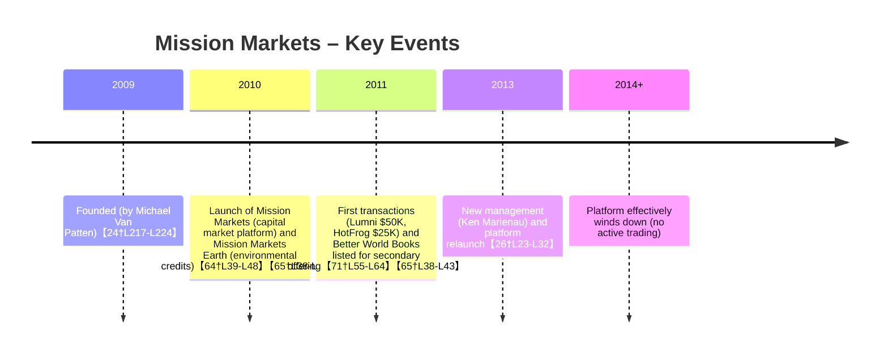

# Why Mission Markets’ 2009 “Local Stock Exchange” Failed (Focusing on Secondary Liquidity)

**Executive Summary:** Mission Markets was a New York–based platform founded in 2009 by Michael Van Patten to create a FINRA‐regulated marketplace for social and environmental enterprises【65†L38-L43】. It launched in 2010 (including a sister platform “Mission Markets Earth” for environmental credits【64†L39-L48】) and initially attracted ~150 members (over 80 investors, mostly foundations, family offices and HNW individuals【40†L149-L157】). Early transactions were tiny – e.g. Lumni ($50K) and HotFrog ($25K) – and it announced a secondary listing for Better World Books that never translated into true trading【71†L55-L64】【65†L38-L43】. By the mid-2010s Mission Markets had quietly folded, having failed to generate any sustained secondary market. 

The core reason was lack of liquidity: the buyer side and seller side were both too thin. We identify and weigh key factors that stifled trading:

- **Market Structure (High impact):** Mission Markets operated like a brokered placement network, not a continuous order-book exchange【65†L38-L43】. Investors responded to individual offerings via WebEx roadshows【65†L72-L76】, rather than through an automated order book. This “deal-by-deal” model inherently limits turnover: without standing bids and asks, price discovery is poor and trades occur only sporadically【74†L240-L249】. 

- **Investor Types & Incentives (High):** The platform attracted mission-driven investors (foundations, family offices, impact funds) who behave more like philanthropists than speculators【72†L7-L10】【40†L149-L157】. Many valued the social mission and were content to “buy and hold” with patient capital. As one analyst noted, those willing to invest in infrastructure platforms were “few and far between” because impact investors prefer funding direct mission work【72†L7-L10】. In short, the user base had little appetite for rapid trading or arbitrage, so secondary demand was weak.

- **Deal Size & Fragmentation (High):** Listed issuers sought relatively small amounts (typically 5–6-figure raises). Mission Markets’ first fundraising “pipelines” were very low: e.g. Lumni raised $50K, HotFrog $25K【71†L55-L64】. A Crowdfund Insider report on Canada’s SVX (a similar platform) observed 12 offerings hoping to raise “over $100 million” in aggregate but targeting only ~$2.5 million in initial funding【53†L75-L83】 – about $200–300K per deal. Such micro-deals are spread across diverse sectors (energy, housing, co-ops, etc.), so no single industry or large volumes underpinned the market. As John Page has argued, due diligence costs for very small enterprises can “seem to be a fatal defect for local stocks,” and without scale specialized info services don’t emerge【36†L768-L778】. Here fragmentation meant no deal ever attained critical mass, sharply reducing liquidity.

- **Transfer Restrictions & Compliance (High):** All offerings were private placements under U.S. securities law, meaning shares could only be sold to accredited investors. Mission Markets required accreditation and FINRA membership (via partner broker Hexagon)【26†L23-L32】【65†L79-L84】. This legally restricted resale: typical Reg D shares require a one-year hold and carry transfer paperwork for each state. In effect, each trade needed broker-dealer involvement, making spontaneous peer-to-peer sales impossible. (By contrast, later platforms like India’s SSE devised special instruments and eased retail access【43†L73-L81】, but in 2009–11 such regulatory tailoring did not exist.) These restrictions thinned the pool of eligible buyers and forced cumbersome compliance, dramatically impeding any secondary market (High impact).

- **Valuation Opacity & Price Discovery (High):** Without an active trading venue, share prices remained opaque. Mission Markets founder Van Patten explicitly aimed to bring “transparency, standardization and price discovery” to impact investing【74†L240-L249】, implying that none existed initially. In practice, buyers had no reliable market price for any enterprise – each transaction became a negotiated one-off. For example, Better World Books’ listing provided no public quote or auction. This opacity discouraged trades: sellers didn’t know what price to seek, buyers couldn’t benchmark value, and each deal required bespoke due diligence. Limited information flow meant the sector remained illiquid【74†L240-L249】.

- **Exit Mechanisms (High):** Most social enterprises had no easy exit except buyouts. Van Patten observed that typical SGB exits were acquisitions or MBOs at low multiples【74†L181-L189】. An IPO was “rare,” especially since no local stock market existed for such firms【74†L181-L189】. Thus, aside from on-platform trades (which never materialized), investors relied on lengthy holdouts or partial sellbacks. This absence of clear exit paths further sapped liquidity: if an investor must wait years for an acquisition, there is little sense in seeking an intermediate sale. With no IPOs or buy-side bids, liquidity essentially vanished.

- **Market-Making and Liquidity Provision (Medium):** Mission Markets did not attract any designated market makers. Unlike public exchanges with broker-dealers posting bids and offers, here there were no intermediaries ready to take the other side of a trade. The platform’s design didn’t incentivize anyone to carry inventory of impact equities. (In later years, private-market venues like EquityZen or Nasdaq Private Market offer some matchmaking, but Mission Markets had no such automated function.) Without market makers, any individual seller would likely find zero buyers, and vice versa, when they tried to trade – a classic chicken-and-egg blockade for liquidity.

- **Regulatory Constraints (High):** Beyond transfer rules, the regulatory environment was generally hostile to creating “stock exchanges” for private firms. Mission Markets required FINRA registration (and presumably ATS-like oversight), limiting its structural flexibility. Pre-2012, U.S. law had no clear framework for crowdsales – the JOBS Act was still years away. Similarly, SVX’s Ontario relaunch needed a special OSC exemption to allow online private placements【53†L62-L64】. In practice, these rules confined Mission Markets to serve only sophisticated U.S. persons, cutting out average local investors. By contrast, India’s SSE (launched 2023) directly involved SEBI and new instruments to legalize non-profit listings【43†L50-L58】. Thus, stringent securities laws posed a major (High impact) barrier to liquidity.

- **Technology & Infrastructure Limits (Low/Medium):** Mission Markets offered a web-based portal for document exchange and deal listings, but lacked revolutionary tech. Settlement of any trade likely required conventional banking and legal settlement (e.g. escrow and legal transfer). There was no digital ledger or real-time atomic settlement. In hindsight, this made transactions slow and trust-dependent, but compared to the above factors it was less decisive. Today’s token platforms (like Stellar) could automate trust and settlement, but circa 2010 that simply didn’t exist. Thus, tech factors were a drag but not the primary limiter (medium impact).

- **Behavioral and Network Effects (High):** Finally, Mission Markets failed to build network momentum. Each new issuer needed a matching investor, but with only dozens of participants, the market never “tipped.” Local exchanges thrive on broad community engagement, but neither issuers nor buyers flocked. As [53] notes about SVX, even initial excitement (12 Ontario issuers) signaled only modest demand【53†L75-L83】. Mission Markets similarly could not attract critical mass. The SOCAP commentator Kevin Jones pointed out that creating infrastructure often appeals less to impact investors than funding mission programs【72†L7-L10】. In network terms, few users meant few trades, which in turn kept others away – a reinforcing negative network effect (High impact).

Together, these factors explain why Mission Markets never saw a liquid secondary market. Although the founders touted early successes, those were promotional. In reality **no meaningful volume of trades occurred**, and investors reportedly saw their holdings remain untraded until businesses found other exit routes. 

## Comparison to Similar Platforms 

| Platform (Launch)                 | Model                                 | Liquidity Outcome           | Key Drivers of Outcome                     |
|-----------------------------------|---------------------------------------|-----------------------------|--------------------------------------------|
| **Mission Markets (2009)**        | FINRA-regulated private-placement portal with curated impact offerings【65†L38-L43】 | *Failed (nearly zero secondary trades)* | Regulatory burden, limited accredited pool, lack of market-makers, small deal sizes, opaque pricing (see above) |
| **IIX Impact Exchange (2012)**    | Singapore-based social enterprise marketplace (Impact Partners for deals) plus **Impact Exchange** (Mauritius stock exchange collaboration)【48†L114-L123】 | *Minimal trading; one bond issuance* | Public bond (Women’s Impact Bond) listed【48†L114-L123】 but few follow-on issuers; remote listing venue, investor unfamiliarity; limited local investor base (Kenya/Asia ties); regulatory complexity. |
| **SVX, Canada (2013)**            | Ontario-based impact crowdfunding (accredited investors only, OSC-exempt)【53†L60-L69】 | *Low (primary fundraises only)* | Operating under provincial exemptions【53†L60-L69】; deal sizes small; investor pool (accredited Ontarians) limited; no built-in trading facility. |
| **India SSE (2019)**             | Social Stock Exchange on BSE/NSE, with special instruments (ZCZP, social funds)【43†L73-L81】 | *Early (first listing Dec 2023)* | State-led launch (legitimacy)【43†L49-L58】; new bond-like instrument for NGOs (ZCZP)【43†L75-L81】; standards and self-regulators for transparency. Still nascent; true liquidity TBD. |

*(Table: Impact-focused marketplaces. “Liquidity Outcome” is assessed qualitatively based on market activity. “Key Drivers” summarize main success/failure factors from cited sources.)*

## Design Recommendations for a Tokenized Mission Markets 2.0 

To enable real secondary liquidity on Stellar/SDEX, a new **Mission Markets 2.0** should address each failure point:

- **On-Chain Asset Issuance with Compliance:** Represent shares or credit units as on-chain tokens with built-in compliance (e.g. Stellar’s asset trustlines and SEP-8/KYC anchors). Every tokenized security should carry metadata (or live “passport” flags) indicating regulatory status (accredited, RegA, etc.), preventing unauthorized transfers. This automates the compliance that once had to be handled manually.  

- **Order-Book + AMM Hybrid for Liquidity:** Use Stellar’s orderbook for limit orders *plus* liquidity incentives. For each listed asset, require issuers or sponsors to seed an initial liquidity pool (or obligation to quote at certain spreads), possibly funded by platform tokens or community treasuries. Gamify market making: e.g. reward addresses that post valid bids/asks with protocol fees. This ensures buyers and sellers can match continuously, mitigating the “no market maker” problem.  

- **Fractional & Wide Investor Base:** Allow very small purchases via token divisibility, opening retail participation where legally permitted (e.g. via Reg A+ or Reg CF frameworks). One could pool shares into a token (e.g. an ERC-20–style security on Stellar) to reach scale. This counters the small-deal fragmentation by enabling investors to trade tiny amounts, building depth over time.  

- **Transparent Pricing & Reporting:** Publish financials and performance data on-chain or via linked oracles/anchors in standardized formats. Smart contracts could enforce on-time reporting. With all trades recorded on the ledger, historical price data will accumulate, helping valuation. This tackles the price-opaqueness (as Van Patten envisioned), making the market more navigable for participants.  

- **Certified Market Makers & Automated Trading:** Formally onboard regulated dealers or FINRA-like entities as liquidity providers on Stellar (similar to how some security-token platforms do). Alternatively, use Stellar’s decentralization: allow any qualified market participant to run a trading bot. The key is to reduce friction so that whenever an investor wants to exit, a counterparty is readily available.  

- **Integrated Custody/Settlement:** Use Stellar anchors to custody collateral and facilitate atomic settlement of securities-for-funds. For example, implement an escrow smart contract (or centralized trust with fail-safes) that simultaneously transfers tokens and stablecoin payment. This mirrors stock-exchange T+2 settlement but done atomically, boosting confidence and reducing settlement risk.  

- **Governance & Listing Criteria:** Establish a transparent, perhaps on-chain governance structure for which issuers can list. This might include community voting or a self-regulatory organization to vet impact claims (much like India’s SROs for social audits【43†L101-L109】). Clear rules (e.g. requiring audited impact reports) build trust and attract more users.  

- **Leverage Network Effects with Local Anchors:** Partner with local impact networks (NGOs, co-ops, community development groups) to seed listings and memberships, rather than trying to build nationwide from Day 1. Use on-chain “community tokens” or localized fiat-anchors to tie the exchange to local economies (echoing the local-exchange vision). More grassroots buy-in means both issuers and investors come equipped with trust relationships.  

- **Flexible Regulatory Layers:** Consider layering jurisdictions: For U.S. investors, embed Reg A+/D/CF rules into token-smart-contract logic (e.g. lockups, cap per investor). For international ones, use Stellar’s global nature to allow e.g. Reg S versions. This allows both broad retail access (within compliance) and institutional deals. Dynamic compliance flags on-chain would eliminate the old problems of static accredited lists.  

These features collectively attack the causes of Mission Markets’ illiquidity. By encoding compliance into the protocol, enabling continuous order flow, and incentivizing active participation, a Stellar-based Mission Markets could achieve the transparency and depth 2009’s model lacked【74†L240-L249】【71†L55-L64】. In short, use blockchain’s strengths (atomic swaps, global network, programmable rules) to build in the “missing pillars” of liquidity – and thus fulfill the original vision on a firmer foundation.

**Sources:** Contemporary press and interviews from Mission Markets and similar platforms【65†L38-L43】【71†L55-L64】【26†L23-L32】【53†L75-L83】【43†L69-L72】; platform documentation (press releases, regulator filings); and analyses of secondary/private markets【74†L240-L249】【36†L768-L778】. These sources collectively document the platform’s trajectory and the liquidity challenges described above.
