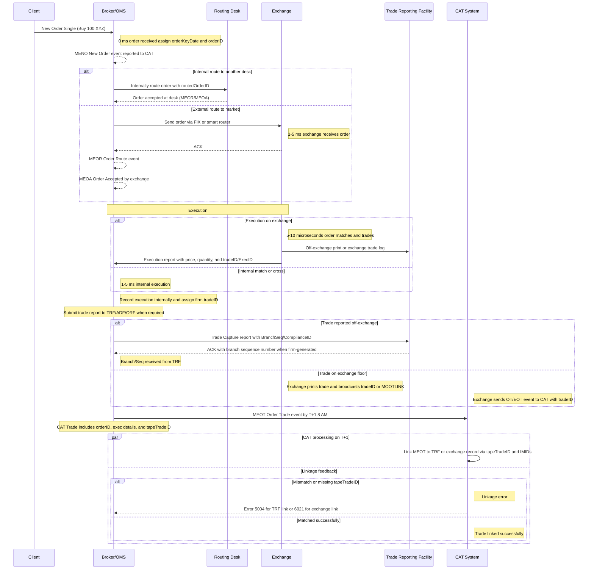

# Executive Summary

Order and trade events flow from the client through the broker’s systems to the market and into CAT with millisecond timestamps. A new order (CAT "MENO") is assigned an orderID and orderKeyDate (event timestamp) at receipt【37†L72-L77】. The order may be routed internally or externally, generating routing events (e.g. Order Route "MEOR") linked by keys (sender IMID, destination IMID, symbol, routedOrderID)【37†L119-L124】. Upon execution, the broker reports a CAT Trade event ("MEOT") and also files a trade report to a TRF/ADF/ORF or the exchange. In the CAT Trade event, the tapeTradeID field must match the unique ID from the trade report: the FINRA Branch/Sequence Number or Compliance ID (for off-exchange trades) or the exchange-assigned trade ID (for exchange prints)【51†L11146-L11154】【24†L4338-L4341】. CAT processes these events in a "daisy-chain" linkage; it matches the Trade event to the corresponding trade-report/Exchange Trade (OT/EOT) via the tapeTradeID and other keys【53†L3379-L3383】【28†L3980-L3988】. If the tapeTradeID is wrong or absent, specific CAT errors are raised: Code 5004 if the tapeTradeID on a Trade event doesn’t match the branch/seq (TRF/ORF) report【13†L26716-L26720】; Code 6021 if the tapeTradeID doesn’t match the exchange’s trade identifier (e.g. MOOTLINK on an OT)【15†L26840-L26844】. This report surveys official CAT and FINRA/Exchange specs, implementation notes and industry literature to detail each step of the order/trade lifecycle (with timestamps), how tapeTradeID and orderID are assigned, and how linkage errors arise and are handled.

## Key References and Specifications

| Document | Scope & Audience | Covers tapeTradeID/orderID | Event Sequencing & Keys | Timestamps | Message Flows | 5004/6021 Errors |
| --- | --- | --- | --- | --- | --- | --- |
| CAT Technical Specs v4.2.0 (Apr 2026)【51†L11146-L11154】【13†L26716-L26720】 | Industry Member reporting standard. Defines all CAT event formats and linkage rules. | Defines orderID uniqueness (unique within orderKeyDate, IM, symbol)【37†L72-L77】 and tapeTradeID meaning (must equal TRF branch/seq or compliance ID for off-exchange trades, and must equal exchange tradeID/MOOTLINK for on-exchange trades)【51†L11146-L11154】. | Specifies all linkage keys (order key, route key, trade key, etc). Table 7/Item 6 and Table 7/Item 8 show linking CAT "MEOT" to TRF/ADF/ORF reports and to exchange OT events【33†L4046-L4055】. Table 11-12 give examples (e.g. tapeTradeID vs exchange tradeID)【24†L4338-L4341】【26†L4375-L4382】. Linking is not based on timestamp but on matching key fields【53†L3379-L3383】【28†L3980-L3988】. | Events carry eventTimestamp (to nanosecond precision) as an ISO8601 string (e.g. "20190419T092316.123456789")【47†L3335-L3339】. The spec notes that links use keys, not timestamps【53†L3379-L3383】. Order/trade timestamps are recorded by the broker/venue clock (often hardware-synchronized). | Details flow of CAT messages: e.g. Order events (MENO, MEOR, MEOA), Trade events (MEOT/MOET), Order Fills (MEOF), etc. Shows how, e.g., an off-exchange Trade event must include the CATReporterIMID and tapeTradeID to link to the broker’s TRF report【33†L4046-L4055】; an on-exchange floor trade must include the exchange’s tradeID (MOOTLINK) in tapeTradeID【15†L26840-L26844】【24†L4338-L4341】. | Error codes are listed in the spec. 5004 = "Named – Matching tapeTradeID cannot be found" (triggered when the Trade event’s tapeTradeID doesn’t match the branch/seq or compliance ID on the corresponding TRF/ADF/ORF report)【13†L26716-L26720】. 6021 = "tapeTradeID did not match" (triggered when the Trade event’s tapeTradeID doesn’t match the exchange’s trade identifier, e.g. the MOOTLINK from the exchange OT)【15†L26840-L26844】. The spec also lists checks for mismatched symbol/side/marketCenter in Tables 164–167. |
| CAT FAQs (2026)【17†L86-L88】 | CAT Plan FAQs (public). | Confirms tapeTradeID "must precisely match" the branch/sequence or compliance number on the TRF/ADF report【17†L86-L88】. Explains that branch/sequence number need not be unique by itself across a day (only combination with IMID)【17†L86-L88】. | General CAT guidance; not a spec, but answers e.g. order lifecycle and reporting questions. (No formal keys, but clarifies tapeTradeID usage). | (Timestamps not covered here.) | N/A (FAQs do not diagram flows). | Not specifically on error codes 5004/6021, but explains common trap: any mismatch (including spacing/case) triggers linkage errors【17†L86-L88】. |
| FINRA TRF / ORF / ADF Guides【19†L649-L658】【22†L325-L333】 | Trade reporting facility (FIX) specs. E.g. NYSE TRF FIX message spec【22†L325-L333】. | Defines the trade-report fields used by CAT’s tapeTradeID: Branch Sequence Number (tag 523) or FINRA Compliance ID (tag 376)【22†L325-L333】. These values are assigned by TRF/ORF/ADF and exactly match what CAT expects in tapeTradeID【51†L11146-L11154】. | (Not about CAT events, but about trade-report IDs). | N/A (trade reports have their own TransactTime fields). | Shows how a firm submits a trade report via FIX (10-sec reporting by TRF rules). The example in NYSE TRF spec indicates fields like TradeReportID, OrderID, Price, Side, PartNo/PartyRole with Branch/Sequence (tag 523) and ComplianceID (tag 376)【19†L649-L658】. This is the source of the tapeTradeID that CAT will use. | These guides don’t mention CAT errors; but key: if the broker mis-populates Branch Seq/Compliance in the trade report, or mis-copies it to CAT, a 5004 error would result【13†L26716-L26720】. |
| Exchange/Display-Only Venue Reporting Guides (e.g. Cboe, NYSE Floor)【26†L4375-L4382】【24†L4338-L4341】 | Exchange technical docs for off-book prints. E.g. Cboe Options Town Hall and CAT mapping. | Define the exchange’s own trade ID (e.g. tradeID or executionCodes/MOOTLINK). CAT’s tapeTradeID for exchange trades must match this ID【24†L4338-L4341】【26†L4375-L4382】. The CBOE presentation (2021) notes that MOOTLINK from the Floor trade must be used. | Example linkage keys for exchange trades: Table 11 (options MOOT/OT) and Table 12 (NYSE MEOT/EOT) in the CAT spec show how fields match (exchange tradeID ↔ CAT tapeTradeID)【24†L4338-L4341】【26†L4375-L4382】. Exchange "sender/receiver" ID tables show e.g. MOOT ↔ OT with tapeTradeID field. | (Exchange logs have their own timestamps; CAT receives them in eventTimestamp via participant). | Specifies how an exchange’s system reports a print. For example, NASDAQ publishes an Execution Report with ExecID, NYSE with TradeID, CBOE with Mkt data (MOOTLINK). These values appear in CAT’s tapeTradeID field. E.g., in NYSE Floor trades, Table 12 shows the same "ABCD12345" appearing as tradeID on the EOT and tapeTradeID on the MEOT【26†L4375-L4382】. | On-floor/exchange events use error codes like 6021–6029. 6021 specifically is "tapeTradeID did not match" (exchange)【15†L26840-L26844】. If a CAT trade event lists a tapeTradeID that doesn’t equal the exchange’s OT tradeID/MOOTLINK (exact match), 6021 is raised. Similarly, 6023–6027 check marketCenterID, side, etc. |
| Industry Articles/Whitepapers (FlexTrade Blog, FINOPS)【36†L209-L218】【48†L99-L104】 | Industry commentary on CAT and high-frequency trading. | Not formal guidance, but note that CAT events rely on order IDs set at entry. Stress that CTS (OATS) vs. CAT differences in IDs. | Discusses high-level CAT implementation; some mention inter-firm routing keys (not tapeTradeID specifics). | (Focus is on compliance, not timestamps). | Describe end-to-end workflow (order to CAT). FlexTrade blog emphasizes linking orders and routes, noting that "all order arrivals, executions, and routes [are] reported" and inter-firm linkages ("routedOrderID") introduced in CAT phase 2【36†L209-L218】. | No technical error code details, but highlights that mismatches of linkage keys (like routedOrderID, CATReporterIMIDs) cause errors. E.g. "If those [linkage] keys don’t match on either side, then there is a break"【36†L237-L241】. Points out that 5% error rate triggers needed. |
| Regulatory Background (SEC Concept Release, CAT FAQ)【17†L86-L88】【38†L5-L9】 | Context and requirements for CAT. | Concept releases outline goal to collect every order/ trade. Explain that CAT uses identifiers already in trade reporting systems (branch seq, execID)【51†L11146-L11154】. | Describe the "daisy-chain" linkage model: CAT Event ↔ Order ↔ Route ↔ Trade, not based on time ordering【53†L3379-L3383】. | Cat FAQ P: Clock sync (members must align clocks to UTC). Concept release mentions needing millisecond timestamps. | SEC background rule filings detail what events to report (aligns with CAT spec). E.g. SEC Release 34-45722 (2012) states all order/trade info must be centralized. (These are high level.) | Regulatory filings don’t list CAT error codes, but FINRA press releases note firms had to fix mismatches after Phase 2 rollout (e.g. 40% linkage errors initially【36†L219-L226】). Error codes like 5004/6021 are documented in CAT rules (as above). Concept release/SRO filings mention linking trade reports to orders as key. |

## Order/Trade Lifecycle (Millisecond Timeline)

The chart below illustrates a stylized sub-second timeline of an equity order flowing through a broker’s OMS/EMS, execution, trade reporting, and into CAT. (Time values are indicative; actual systems may operate in microseconds.)

Each CAT event above has an associated timestamp. For example, when the broker reports the new order, the orderKeyDate field in the MENO event is set to the current date/time (e.g. "20190419T092316.123456789")【47†L3335-L3339】. All reported events use Coordinated Universal Time with nanosecond precision. The orderID (assigned by the broker’s OMS) must be unique within the tuple (orderKeyDate, CATReporterIMID, symbol)【37†L72-L77】. Routing events (MEOR/MEOA) reuse that key and add the routedOrderID for linkage【37†L119-L124】. After execution, the Order Trade (MEOT) event includes the internal tradeID and the external linkage ID in the tapeTradeID field. If the execution was off-exchange, that is the TRF’s Branch-Seq or Compliance ID; if on-exchange, it is the exchange’s tradeID (e.g. MOOTLINK)【51†L11146-L11154】【26†L4375-L4382】.

## Linking and Error Codes (5004 vs 6021)

CAT’s linkage process matches Trade events to the corresponding trade report or exchange event by comparing key fields, including the tapeTradeID. Per the specs, a firm’s Trade event can link to either the "reporting" side or the "contra" side of the trade report, but the tapeTradeID must match that chosen side exactly【28†L3980-L3988】. If a broker reports a trade but omits or mistypes the tapeTradeID, CAT cannot link it to the TRF report and will generate a linkage error. Specifically:

- Error 5004 (TRF Linkage) – "Matching tapeTradeID cannot be found." This occurs when the industry member’s Trade event names the firm on the TRF/ORF/ADF report, but the tapeTradeID on the CAT report does not equal the Branch Sequence Number (TRF) or Compliance ID (ADF/ORF) on that trade report【13†L26716-L26720】. (Table 164 in the spec describes 5004: "Named on a TRF/ADF/ORF Trade Report, but the tapeTradeID on the Trade event did not match the unique identifier… on the corresponding Trade Report"【13†L26716-L26720】.) In practice, this often means a digit or space mismatch in the Branch/Seq, or using the wrong branch. CAT FAQ also warns that the tapeTradeID must match "including spaces and capitalization"【17†L86-L88】. When 5004 is issued, the firm must correct the Trade event so that tapeTradeID exactly matches the TRF’s ID (or use a reportingExceptionCode if no TRF report was needed).

- Error 6021 (Exchange Linkage) – "tapeTradeID did not match." This is analogous for exchange trades. It is triggered when the firm reported a trade involving an exchange/NYSE floor (so an OT event exists), but the CAT Trade event’s tapeTradeID is not equal to the exchange’s trade identifier. (E.g. for a manual NYSE floor trade, the tapeTradeID must equal the NYSE tradeID provided to the firm【26†L4375-L4382】; for an options trade, it must equal the MOOTLINK in the OT’s executionCodes【24†L4338-L4341】.) Table 166 in the spec defines 6021: "The tapeTradeID reported on a Trade event did not match the unique identifier (e.g., MOOTLINK) provided in the exchange OT"【15†L26840-L26844】. When 6021 occurs, the firm must correct the tapeTradeID (or marketCenterID/side) to match the exchange-supplied values. Additional codes (6023–6029) cover mismatched market center, side, etc.

Both errors are "Named" errors, meaning CAT reports them on the firm’s end-of-day linkage feedback files (and the firm must submit corrected CAT trades). Firms have until T+3 to fix these in CAT【36†L123-L131】. If not corrected, unlinked trades could be flagged as exceptions.

## Additional Context

- TIMESTAMPS & PRECISION: All CAT events use high-resolution timestamps. The eventTimestamp (often called orderKeyDate or tradeKeyDate depending on context) is set to the UTC time of the event to the nanosecond. For example, the spec shows an orderKeyDate like 20190419T092316.123456789【47†L3335-L3339】. Exchanges themselves stamp trades at microsecond-level【48†L99-L104】, and CAT requires firms to align clocks via NTP/PTP. However, linkage is not based on times; CAT explicitly links events by keys, not by ordering of timestamps【53†L3379-L3383】.

- ORDER IDs: The broker’s internal orderID is created at order entry (MENO event) and must be unique per day per symbol per IMID【37†L72-L77】. This orderID is propagated in route and trade events to track the same order. For example, multiple fills of one order use the same orderKey (date+IMID+ID) and appear in the buyDetails/sellDetails of the MEOT event. CAT linkage uses this to match multiple trade messages to the original order (the "Order Key" in Table 5【53†L3379-L3383】).

- ROUTING: Each route between brokers or to exchanges generates Order Route events with their own routedOrderID. These form route linkage keys (eventDate, senderIMID, destination, symbol, session, routedOrderID)【37†L119-L124】. Mis-matches in routedOrderID or sender/receiver IDs between the sender’s MEOR and receiver’s MEOA events can cause linkage rejections (errors not in 5004/6021 family). Industry vendors have noted many inter-firm "Order Accepted" vs "Order Received" mismatches when firms use different IMIDs or ID conventions【36†L237-L241】.

- TRF/Exchange Reports: When a trade executes off-exchange (e.g. a block trade or internal cross), firms must report it to an appropriate TRF/ADF/ORF. That report’s Branch Sequence Number or Compliance ID becomes the trade’s reference ID. The spec instructs that this ID must be the CAT tapeTradeID【51†L11146-L11154】. If the trade is on an exchange (print), the exchange’s print identifier (e.g. tradeID) is used. E.g., Table 12 shows a NYSE manual print with tapeTradeID "ABCD12345" matching the exchange tradeID【26†L4375-L4382】. The broker must obtain that exchange ID (either via FIX exec report or from the Exchange’s published Order/Trade events) and use it in CAT.

- Linkage Philosophy: CAT links each event in a "daisy chain" using keys, not timestamps【53†L3379-L3383】. For trades, the TRF Linkage Key (Table 7) is (EventDate, CATReporterIMID, symbol, tapeTradeID, marketCenterID)【33†L4046-L4055】. For exchange trades (floor prints), the Exchange Trade Linkage Key is (EventDate, optionID/symbol, tapeTradeID, marketCenterID, side)【33†L4046-L4055】. These must match between the Trade event and the corresponding TRF report or OT event, or an error is issued.

## Sources and Further Reading

This analysis is based on authoritative sources: the CAT Industry Member Technical Specifications v4.2.0 (2026) (all citations above), CATNMSPLAN FAQs, and public TRF/exchange reporting guides. We also drew on industry articles (e.g. FlexTrade commentary) and research on market microstructure for context (e.g. exchanges process orders in microseconds【48†L99-L104】). Key parts of each document are summarized in the comparison table. Where details are absent in these sources, we note it explicitly. (For example, academic papers have not yet examined CAT linkage errors specifically.)

Key References: CAT Specs v4.2.0 (industry member section)【51†L11146-L11154】【13†L26716-L26720】; CAT FAQ (branch/seq matching)【17†L86-L88】; FINRA TRF FIX spec (branch/seq fields)【22†L325-L333】; Cboe/NYSE reporting guidelines (exchange trade IDs)【24†L4338-L4341】【26†L4375-L4382】; industry discussion of CAT linking【36†L237-L241】; HFT/microsecond context【48†L99-L104】.
